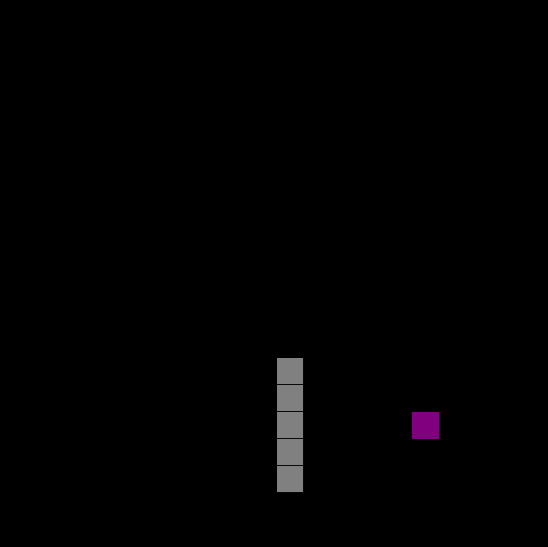

# Snake Game

> Jogo da Cobrinha

Projeto construído para treinar minhas habilidades em JavaScript.

[Clique aqui para acessar](https://guimiiller.github.io/snake-game/)

## 🚀 Tecnologias

- HTML
- JavaScript
- Git e Github

## 💻 O que aprendi

- Aprendi a pintar a tela com fillStyle e fillRect
- Chamar uma função várias vezes com setInterval
- Usar o switch para saber qual tecla foi pressionada e mudar a direção da cobra

## Contato

guilhermemillerblack@gmail.com